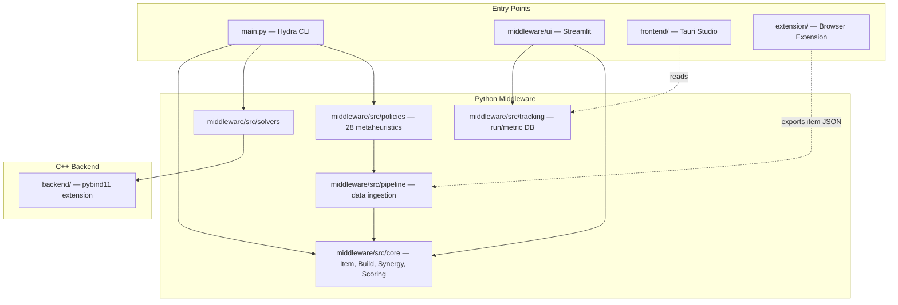

# Architecture

## Module Boundaries

## Layering Rules

- `middleware/src/core` is the domain model and must not import from `middleware/ui` or `backend/`.
- `backend/` exposes a stable `pybind11` API (`build_optimizer_backend`); Python code only calls into it through `middleware/src/policies`, never imports backend internals directly.
- `frontend/` (Tauri) is a presentation layer — it reads from the middleware's tracking database and shells out to `main.py`; it does not reimplement solver logic. `extension/` (browser extension) only produces item JSON for `middleware/src/pipeline`'s `FileSource` — it has no runtime dependency on the rest of the stack.

## Data Flow

1. Hydra composes `game` + `optimization` + `pipeline` + `policy` configs (`middleware/configs/`).
2. `middleware/src/pipeline` loads items via `FileSource`/`GameAPISource`/`WebScraperSource`.
3. The selected solver (native Python or `backend/`-bound C++) searches for the best build under `middleware/src/core.scoring`.
4. Results are persisted via `middleware/src/tracking` and surfaced in the Streamlit dashboard or the Tauri Studio.

See [`moon/ROADMAP.md`](../moon/ROADMAP.md) for planned architectural additions (lexicographic solve loop, Benders decomposition, GFlowNet policy).
