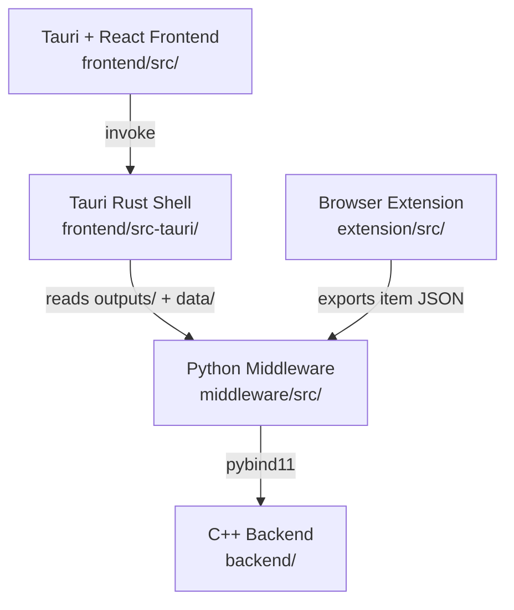

# Build-Optimization Documentation

**Build-Optimization** applies operations-research techniques from combinatorial routing to videogame character build optimization — picking the item, skill, and stat combination that maximizes effectiveness under a resource budget.

---

## What's here

| Section | Description |
| ------- | ----------- |
| [Quick Start](../README.md) | Setup, installation, and run instructions |
| [Contributing](../git/CONTRIBUTING.md) | Code style, Git workflow, PR process |
| [Architecture](ARCHITECTURE.md) | Module boundaries and data flow |
| [Python API (Sphinx)](api/python.md) | Full `middleware/src` reference via sphinx-autoapi |
| [C++ API (Doxygen)](api/cpp.md) | `backend/` solver core reference |
| [Tauri Frontend API (TypeDoc)](api/frontend.md) | `frontend/src` reference |
| [Browser Extension API (TypeDoc)](api/extension.md) | `extension/src` reference |
| [Tauri Rust Shell (rustdoc)](api/rust.md) | `frontend/src-tauri` reference |
| [Roadmap](../moon/ROADMAP.md) | Phased implementation plan |
| [Changelog](../moon/CHANGELOG.md) | Completed work by area |

## Module layout

